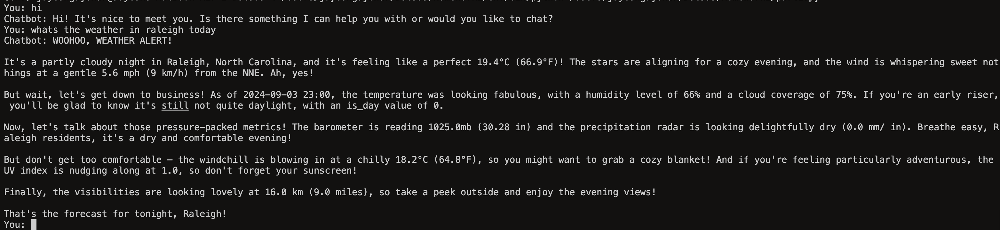
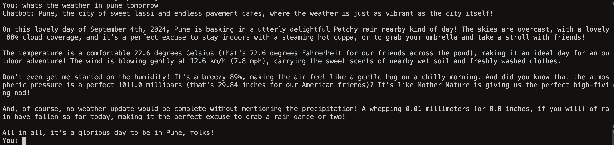

## Homework 2 - Question 1

For this part of the question, I created a chatbot to talk about the weather in a fun way. I used weather API and a snippet of code provided in the first colab notebook, specifically, [Colab Notebook](https://colab.research.google.com/drive/1KtirU3s4_lgITp5ufPMyd4pJg1XiJqmU?usp=sharing#scrollTo=zl803p9Verss)

The chatbot takes input in natural language and calls the weather API by itself whenever it encounters the word "weather" in a conversation.

Here are a few examples:

