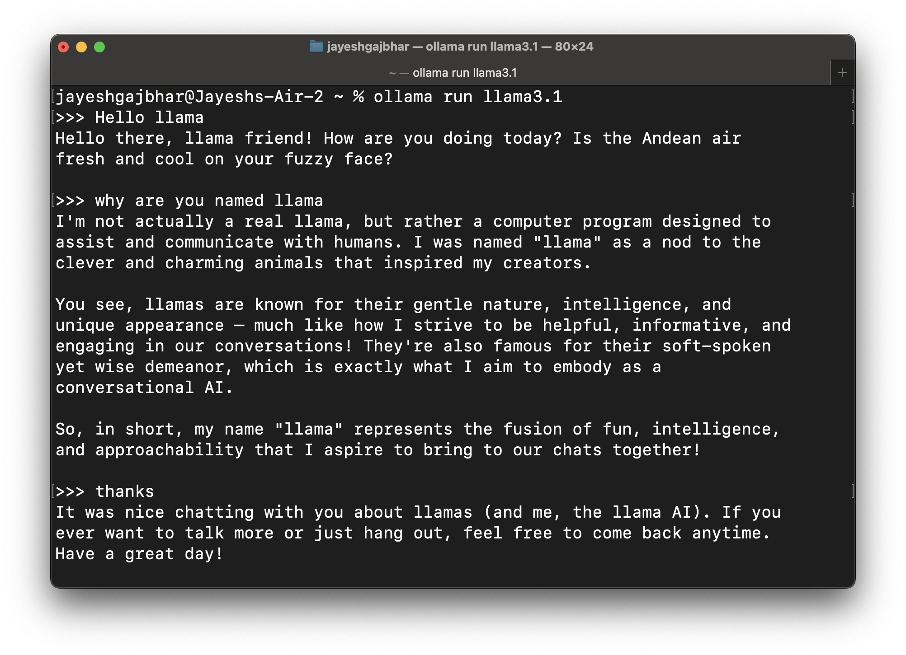
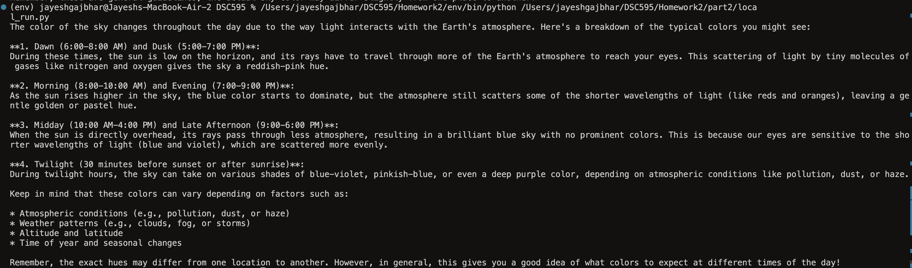
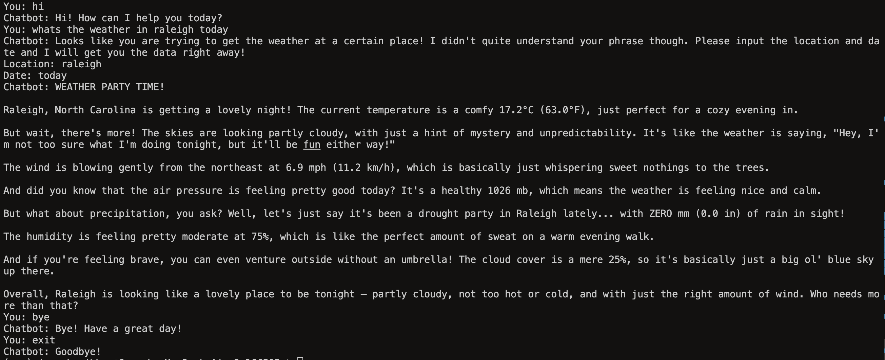

## Homework 2 - Question 2

### Part 1

The objective of this part was to run OlLama locally. Below is an example showing the same.

### Part 2

For this part of the assignment, we had to call Llama as a local API. This has been demonstrated in 'local_run.py' and the result is shown in the image below:

### Part 3

For this part of the assignment, I used the same code from part 1, from weather.py, and made a few modifications, i.e., using the Ollama API instead of the Groq API.

The chatbot has been demonstrated in the image below:

